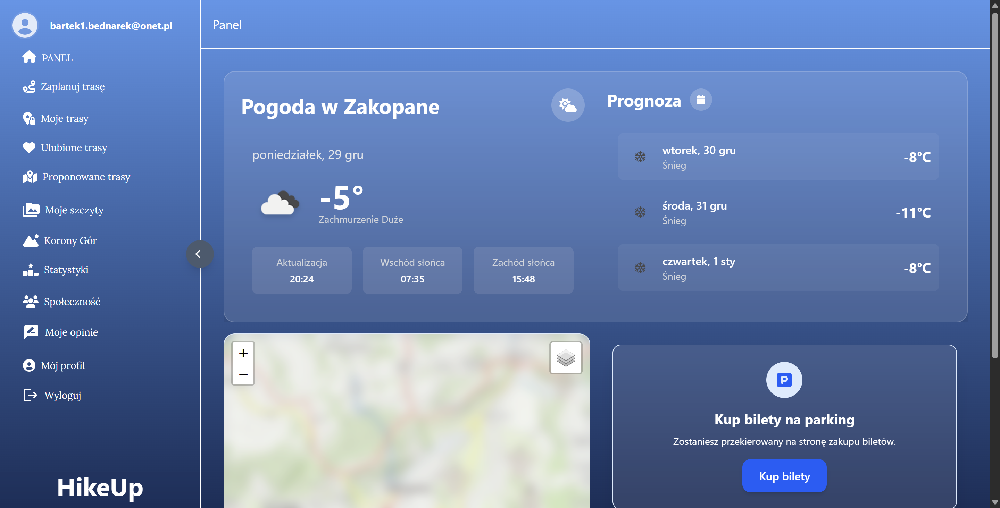
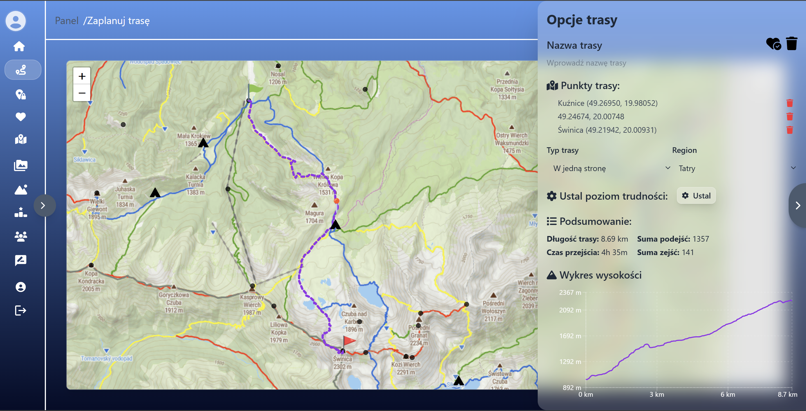
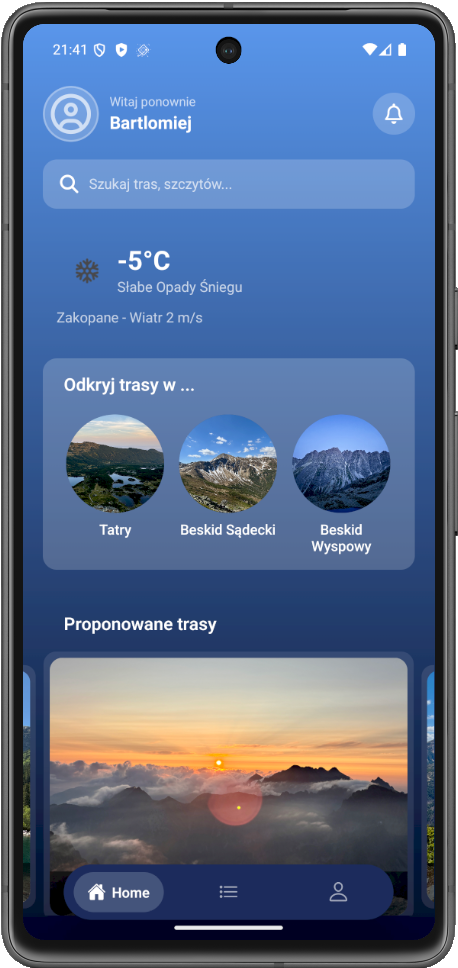

# HikeUp
_APLIKACJA TURYSTYCZNA DO PLANOWANIA PODRÓŻY W GÓRACH WEDŁUG RÓŻNYCH POZIOMÓW TRUDNOŚCI_

[Dokumentacja projektowa](https://drive.google.com/file/d/1w6lGILBceVhF2-pBnC3qradM2XWm2F_Z/view?usp=sharing)

[Demo](http://158.180.33.62:3000/)

[Dokumentacja API](http://158.180.33.62:6868/api-docs/)

## Funkcjonalności
- Zarządzanie użytkownikami
- Przeglądanie i wyszukiwanie tras
- Tworzenie i zarządzanie trasami
- Mapy i lokalizacja
- Szczyty górskie
- Funkcje społecznościowe
- Statystyki i historia

## Technologie
### Frontend (Web)
- React.js – budowa interfejsu użytkownika
- TypeScript – statyczne typowanie i bezpieczeństwo kodu
- Tailwind CSS – stylowanie interfejsu (utility-first)
### Aplikacja mobilna
- React Native – aplikacja mobilna Android/iOS
- Expo – środowisko i narzędzia developerskie
- NativeWind – stylowanie mobilne (Tailwind dla React Native)
### Backend
- Node.js – środowisko serwerowe
- Express.js – REST API i logika biznesowa
### Baza danych
- PostgreSQL – relacyjna baza danych
- PostGIS – obsługa danych geoprzestrzennych

### Integracje zewnętrzne
- API mapowe
- API pogodowe
- API wysokościowe

## Widoki apliakcji
_Panel glówny_

_Mapa planer_

